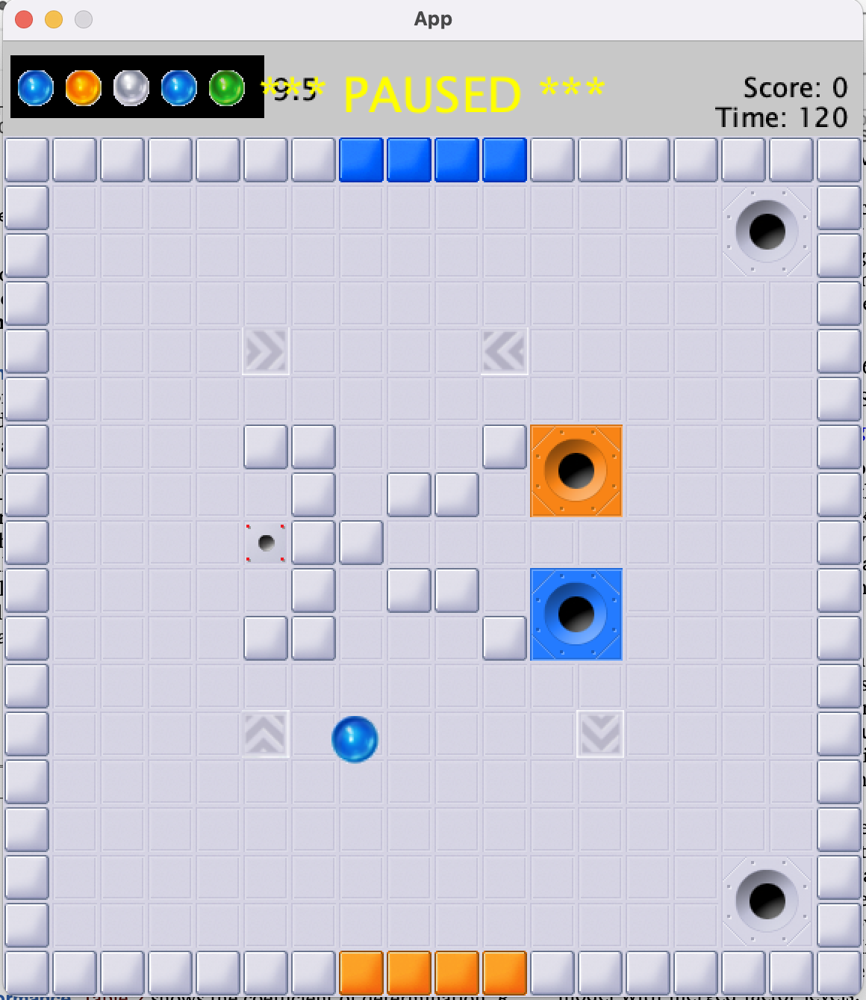
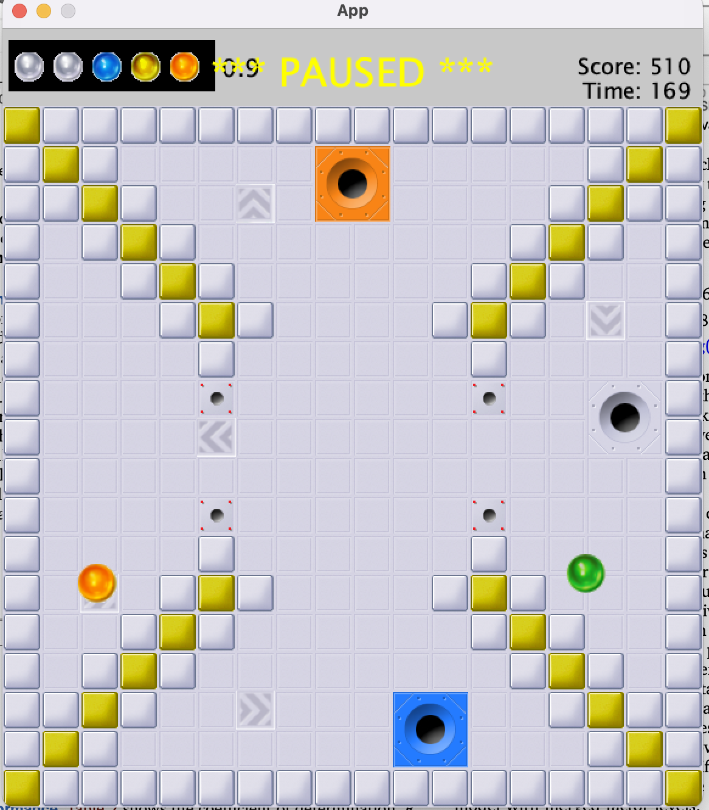
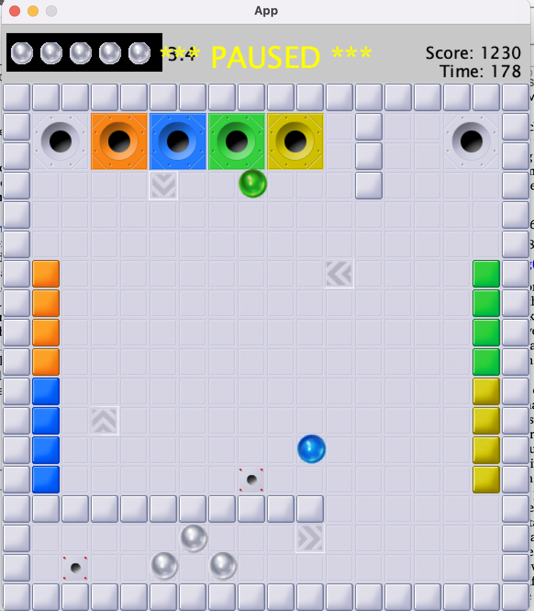
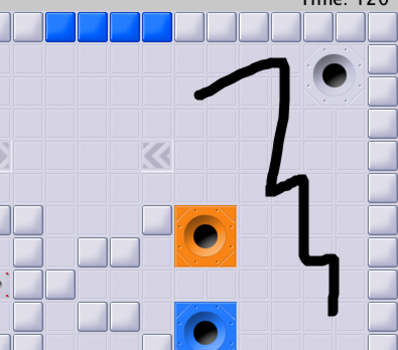

# Inkball Game

Welcome to the **Inkball Game** repository! This project is a recreation and extension of the classic Inkball game to showcase object-oriented design principles, modular architecture, and clean code practices.

## Table of Contents

- [Introduction](#introduction)
- [Features](#features)
- [Architecture](#architecture)
  - [Core Classes](#core-classes)
  - [Extension: AccelerationTile](#extension-accelerationtile)
- [Design Principles](#design-principles)
- [Installation and Setup](#installation-and-setup)
  - [Prerequisites](#prerequisites)
  - [Steps](#steps)
  - [Notes](#notes)
- [How to Play](#how-to-play)
- [Future Improvements](#future-improvements)
- [Contact Information](#contact-information)
- [License](#license)

## Introduction

The Inkball Game is a puzzle game where players guide balls into holes of matching colors by drawing lines and manipulating various game elements. This project demonstrates proficiency in Java programming, game development, and software design patterns, emphasizing code reuse, flexibility, and modularity.

To give you a visual overview of the game, here are snapshots of the game state across different levels:

- **Level 1**: Introduction to basic mechanics with minimal obstacles.
  
  


- **Level 2**: Increased complexity with the introduction of walls and more challenging paths.
  
  


- **Level 3**: Advanced gameplay featuring acceleration tiles and intricate layouts.
  
  
  

## Features

- **Interactive Gameplay**: Draw lines to guide balls into their respective holes.
- **Dynamic Components**: Walls, lines, and acceleration tiles alter the movement of balls.
- **Level Management**: Progress through multiple levels with increasing difficulty.
- **Scoring System**: Earn points based on performance and remaining time.
- **Visual Effects**: Smooth animations and rendering of game elements.

## Architecture

The game's architecture is designed for clarity and extensibility, using object-oriented principles to separate concerns and promote code reuse.

### Core Classes

- **`Interactable` Interface**: Defines a contract for game objects that interact with the `Ball`, such as `Wall`, `Line`, and `AccelerationTile`. It includes methods for collision handling, allowing for easy expansion of game elements.

- **`GameObject` Abstract Class**: Encapsulates shared properties like position and dimensions. Classes like `Wall`, `Tile`, `Ball`, and `Hole` inherit from this, streamlining their core functionality.

- **`Level` Class**: Manages key game entities and orchestrates gameplay through state management, collision detection, and rendering. It integrates all game elements, including `Wall`, `Hole`, `Spawner`, `Ball`, `Tile`, and `Line`.

- **`InputHandler` Class**: Manages user input for drawing and removing lines, interacting with the game state to modify gameplay elements.

- **`LevelCompletionAnimation` Class**: Handles the animation sequence when a level is completed, moving tiles and updating the score based on remaining time.

- **`Renderer` Class**: Responsible for drawing all game elements, including tiles, walls, balls, and game messages, ensuring a clean separation of visual rendering from game logic.

- **`App` Class**: Serves as the central hub, handling game setup, level management, user input, rendering, and score tracking. It initializes the environment by loading configurations and resources, and manages progression through levels using a JSON configuration file.

### Extension: AccelerationTile

The `AccelerationTile` class extends the game's functionality by introducing a new type of tile that applies directional acceleration to balls. Implemented as a subclass of `GameObject` and implementing the `Interactable` interface, it allows tiles to interact with the game's core mechanics.

## Design Principles

- **Object-Oriented Programming**: Utilizes interfaces and abstract classes to promote code reuse and flexibility.
- **Modularity**: Separates concerns through dedicated classes for input handling, rendering, and game logic.
- **Extensibility**: Designed to easily incorporate new game elements and mechanics.

## Installation and Setup

### Prerequisites

- **Java Development Kit (JDK) 8**: Ensure that Java 8 is installed on your system. You can download it from [here](https://www.oracle.com/java/technologies/javase/javase-jdk8-downloads.html).
- **Gradle**: The project uses Gradle for build automation. Install Gradle by following the instructions [here](https://gradle.org/install/).

### Steps

1. **Clone the Repository**:

   ```bash
   git clone https://github.com/yourusername/inkball-game.git
   ```

2. **Navigate to the Project Directory**:

   ```bash
   cd inkball-game
   ```

3. **Build the Project with Gradle**:

   ```bash
   gradle build
   ```

4. **Run the Game**:

   ```bash
   gradle run
   ```

### Notes

- **Set `JAVA_HOME`**: Ensure that your `JAVA_HOME` environment variable is set to the path of your Java 8 installation.

  - On **Windows**:

    ```cmd
    set JAVA_HOME=C:\Program Files\Java\jdk1.8.0_xx
    ```

  - On **macOS/Linux**:

    ```bash
    export JAVA_HOME=/Library/Java/JavaVirtualMachines/jdk1.8.0_xx.jdk/Contents/Home
    ```

- **Verify Java Version**: Check your Java version by running:

  ```bash
  java -version
  ```

  The output should indicate Java version 1.8.x.

- **Gradle Wrapper (Optional)**: If you prefer not to install Gradle globally, you can use the Gradle Wrapper included in the project:

  - **Build the Project**:

    ```bash
    ./gradlew build
    ```

  - **Run the Game**:

    ```bash
    ./gradlew run
    ```

- **Multiple Java Versions**: If you have multiple versions of Java installed, you may need to configure Gradle to use Java 8 specifically. You can do this by editing the `build.gradle` file or setting the `JAVA_HOME` as shown above.

## How to Play

- **Objective**: Guide balls into holes of the same color.
- **Controls**:
  - **Draw Lines**: Click and drag the mouse to draw lines that direct balls.
  - **Erase Lines**: Right-click on lines to remove them.
    
  
    
- **Game Elements**:
  - **Walls**: Static obstacles that affect ball movement.
  - **Tiles**: Form the gameplay grid.
  - **Acceleration Tiles**: Change the velocity of balls.
  - **Spawners**: Generate balls at specific locations.
  - **Holes**: Capture balls of matching colors.

## Future Improvements

- **Additional Levels**: Create more challenging levels with new obstacles.
- **Enhanced Graphics**: Improve visual effects and animations.
- **Power-Ups**: Introduce new game mechanics like power-ups or special abilities.
- **Multiplayer Mode**: Implement a mode where players can compete or cooperate.

Thank you for checking out the Inkball Game! Your feedback and contributions are welcome.
